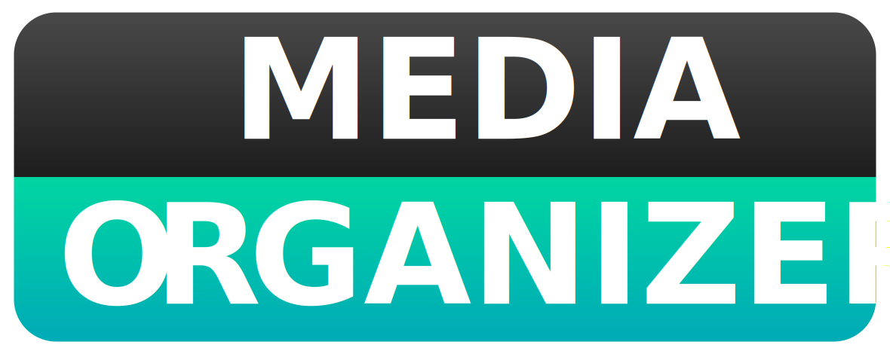

<p align="center">
    </img>
</p>

<p align="center">
    
    
    
</p>

<p align="center">A simple organizer for your library</p>

### Overview

---

Media Organizer is program developed in Java using the JavaFX library. It’s purpose is to free up space and to organize your media library. It’s focused to be used alongside with Plex and Kodi.
c

### Download

---

```
git clone https://github.com/xriskon/Media-Organizer.git
```
